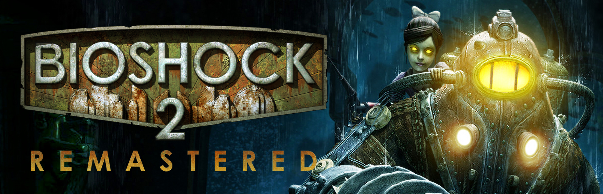

# ☔ BioShock 2 Remastered Plugins

This is a repository created for *BioShock 2 Remastered* which contains a plugin loader proxy dll.

## Table of Contents

- [🌧️ Plugin Loader - VERSION.DLL](#️-plugin-loader---versiondll)
- [🌧️ Installation](#️-installation)
- [🌧️ Directory Structure](#️-directory-structure)
- [🌧️ Plugin Loader Conflicts](#️-plugin-loader-conflicts)
- [🌧️ Plugin Safety](#️-plugin-safety)
- [🌧️ False Positive Antivirus Detections](#️-false-positive-antivirus-detections)
- [🌧️ Copyright](#️-copyright)

## 🌧️ Plugin Loader - VERSION.DLL

`version.dll` is the plugin loader. This DLL file acts as a fake proxy that allows us to load additional plugins into the game automatically by pretending to be the real version.dll the game expects to be loaded.

On launch, the file will:
- Forward all original VERSION calls to the real DLL file the game expects.
- Scans the game directory at "SteamLibrary\steamapps\common\BioShock 2 Remastered\Build\Final", looks for a folder named `BioPlugins`, then locates all DLL plugin files within that folder.
- Automatically loads all the plugins.

## 🌧️ Installation

1. Download the latest release from the Nexus Mods page.
2. Extract the zipped download.
3. Copy the contents of the folder. 
4. Paste the contents within "SteamLibrary\steamapps\common\BioShock 2 Remastered\Build\Final".
5. Place any desired plugins within the `BioPlugins` folder to be loaded. (Note this folder will be automatically auto-generated by the plugin loader if the folder is missing.)
6. Launch the game. The plugins should all be loaded automatically.

## 🌧️ Directory Structure

The directory structure should look like this:

```
\SteamLibrary\steamapps\common\BioShock 2 Remastered\Build\Final\
├── Bioshock2HD.exe
├── version.dll     ← plugin loader
└── BioPlugins/
    ├── Plugins.log ← generated on launch
    └── AnotherPlugin.dll
```

## 🌧️ Plugin Loader Conflicts

If another plugin or mod you are using also ships as a proxy DLL (e.g. their own version.dll), it will conflict with this loader as only one proxy can occupy that filename at a time.

In this case, plugin authors should ship their plugins without the additional proxy. This will allow users to load your plugin within `BioPlugins` without conflicting proxies. 

## 🌧️ Plugin Safety

Plugins are DLL files that run directly inside the game process with full system access. **Only install plugins from sources you trust.**

- Download plugins from reputable sources and players you trust. 
- Avoid downloading plugins from random Discord messages, file sharing sites, or unverified third parties.
- If you are unsure about a plugin, scan it with an antivirus or tools like [VirusTotal](https://www.virustotal.com) before launching the game.
- Be cautious of plugins distributed as password-protected archives, as these are often used to bypass antivirus scanning.
- Check the hashes of any plugins you download if there are public plugins / repositories available.
- You can double check the MD5-hashes match the version you're planning on using. [MD5 File](https://md5file.com/calculator)

## 🌧️ False Positive Antivirus Detections

Some antivirus software may flag the proxy DLL as suspicious. This is a known false positive caused by the nature of DLLs and runtime hooking. The source of detections can be reviewed on VirusTotal. If you are uncomfortable, do not install it.

## 🌧️ Copyright

BioShock 2 Remastered Plugins is an unofficial, non-commercial, community plugin repository. All original game content, including assets, characters, story, and company names, are the property of 2K Games.

These plugins are intended for players who already own a legitimate copy of BioShock 2 Remastered. It is not an official download, patch, or product from 2K Games.

By using these plugins, you agree to respect the intellectual property of 2K Games and only use the content within the context of the plugins intended use.
